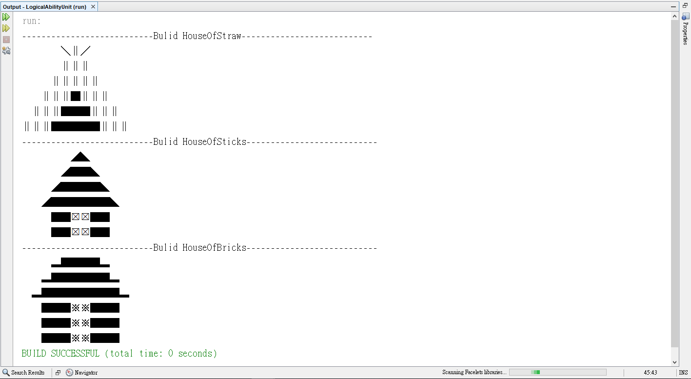

# Program-Entry-Unit-2---LogicalAbility

程式與邏輯，初期較無法完整的撰寫邏輯，可以先以開發的出來為主，

之後再慢慢提升不同的寫法，慢慢改進，進而完成更複雜的邏輯。

#### 學習重點：

1. 初期以最簡單的思考方式，想一步做一步，先完成可動的程式 
2. 將原先的程式做改善，思考怎麼寫可以更好，簡化第一步的方式
3. 拆成可共用的方法，試著變成可以共用的程式邏輯

實際實踐方式可以參考程式範例

------

#### 目標：

寫出    可用的程式 (至少產出正確的結果)  ------>  可閱的程式(把前面的步驟優化的思考) ------>  擴充的程式(彈性高)

------

#### 範例程式：

蓋房屋，蓋出一個茅草屋(使用方法1)、木屋(使用方法2)、磚塊屋(使用方法3)

#### 範例解析：

##### 1. 茅草屋解析 (HouseOfStraw.java) : 

   將房屋以一層一層的方式印出來，每一層都是獨立思考，這樣就可以簡單印出每一層，

   所以有六層，要拆成六次去實踐

##### 2. 木屋解析 (HouseOfSticks.java) : 

   從茅草屋的方式，觀察到一層一層的印出來可以拆成兩個迴圈，這時就可以簡化第一步的邏輯

   比起前一個方式，只要做兩次就好

##### 3. 磚塊屋解析 (HouseOfBricks.java) : 

   這時除了思考原本的方式，就要再去思考擴充，所以這個時候就不是單純的蓋出磚塊屋，而是蓋出磚塊屋的人也可以生產出茅草屋與磚屋，所以變成獨立的一個方法去運作。

